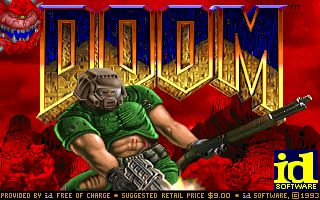
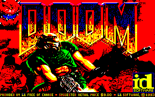
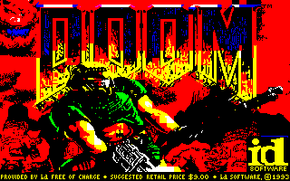

# retrographics
A command-line program that reduces the number of colors in an image and adds attribute clash to it for a retro effect. Requires Python and the [Pillow module](https://python-pillow.org).

Some of the example images are from *Doom* and *Commander Keen: Secret of the Oracle* by id Software. The license of this project doesn't apply to them.

Table of contents:
* [Command line arguments](#command-line-arguments)
* [Examples](#examples)

## Command line arguments
*options* *inputFile* *outputFile*

*options* (all optional):
* `--cellwidth N`: width of attribute cells in pixels; `N` is 8 to 64; default = 8
* `--cellheight N`: height of attribute cells in pixels; `N` is 1 to 64; default = 8
* `--cellcolors N`: maximum number of colors in each attribute cell; `N` is 0 to 16; 0 = unlimited; default = 2
* `--masterpal P`: which master palette to use; `P` is one of:
  * `rgb3`: 3-bit RGB (1 bit/channel, 8 colors); the default
  * `rgb6`: 6-bit RGB (2 bits/channel, 64 colors)
  * `cga`: IBM CGA master palette (RGBI, 1 bit/channel, 16 colors)

*inputFile*: Required. The image file to read. Width must be a multiple of `--cellwidth`. Height must be a multiple of `--cellheight`.

*outputFile*: Required. The PNG file to write. Same width and height as *inputFile*.

## Examples
*Doom* title screen &ndash; original, 3-bit RGB palette without attribute clash, 3-bit RGB palette with no more than 2 colors in each 8&times;8-pixel cell:

